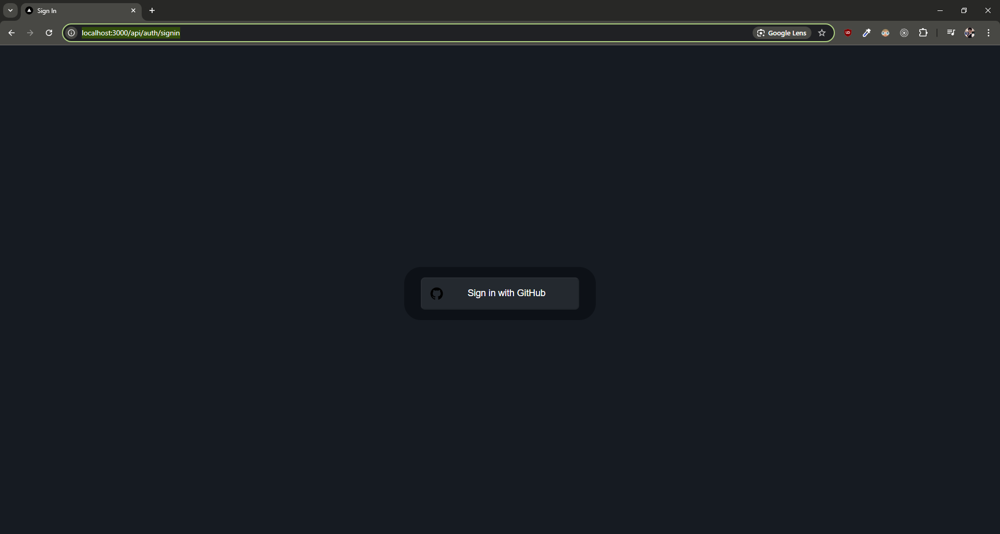
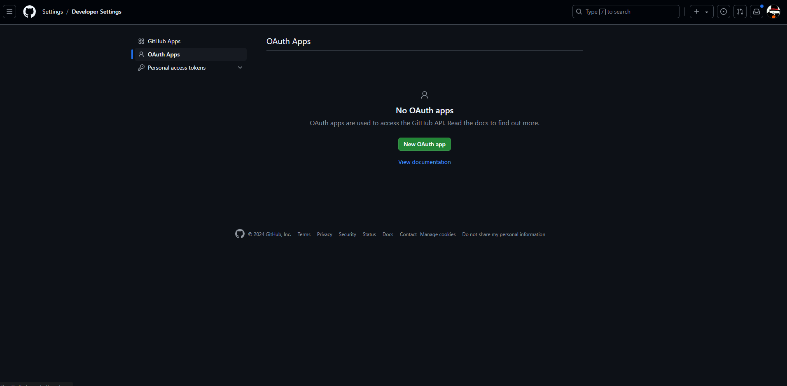
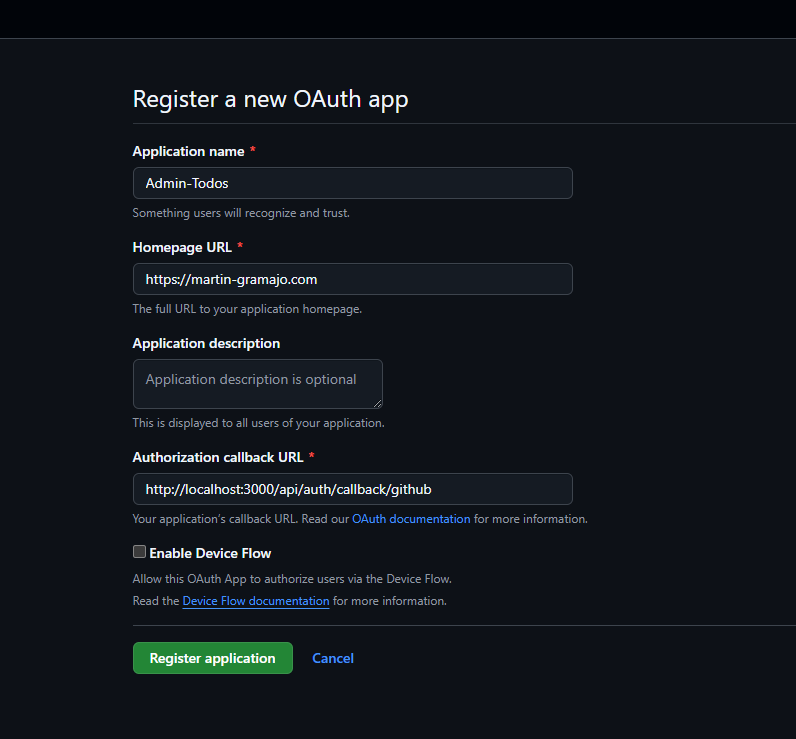
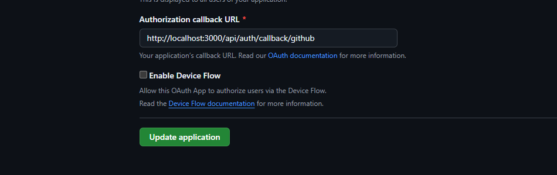
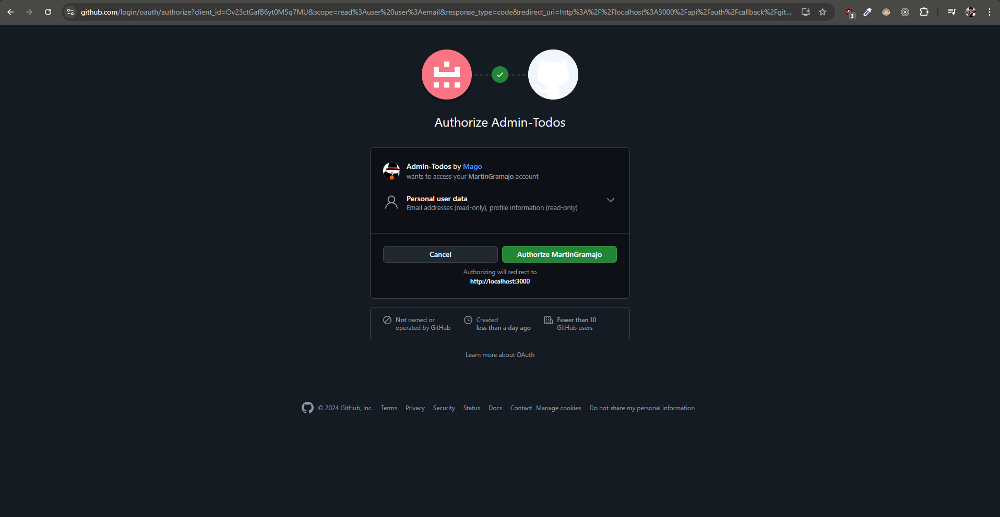

## Auth.js -

El objetivo de esta sección es la autenticación de los usuarios, trabajaremos con Auth.js para tener la base de autenticación inicial y luego la ajustaremos a necesidades personalizadas

Puntos que vamos a trabajar:

1. Auth.js

2. Proveedores (google - github)

3. Credenciales personalizadas

4. Encriptar contraseña

5. Relaciones de bases de datos

6. Sesión de usuario

7. Server y Client side validation

8. Campos adicionales de usuario

9. Modificación global de usuario de Auth.js

La finalidad es poder controlar la sesión y poder tener identificados los usuarios de nuestra aplicación y dashboard administrativo.

# Development

Pasos para levantar la app en desarrollo

1. Levantar la base de datos. Esto con el docker abierto en nuestra PC.

```
docker compose up -d
```

2. Crear una copia de el .env.template, y renombrarlo a .env
3. Reemplazar las variables de entorno.
4. Ejecutar el comando `npm install`
5. Ejecutar el comando `npm run dev`
6. Ejecutar estos comando de prisma: Estos comando los ejecutamos porque la base al estar totalmente limpia no se ejecutaron los comando de migración ni el de generación del cliente (no hay regeneración del cliente ni tenemos ese schema en sintonía con nuestra base de datos).

```
npx prisma migrate dev
npx prisma generate
```

7. Ejecutar el SEED (esto es para reconstruir la base de datos local ) para [crear la base de datos local](http://localhost:3000/api/seed)

# Prisma commands

```
npx prisma init
npx prisma migrate dev
npx prisma generate
```

# Prod

# Stage

## Auth.js - Configuration iniciales

1. Comando de instalación : `npm install next-auth `
   Nota: el comando estaba requiriendo una instalación legacy o force.

[Documentación para Auth.js - Authentication for the web](https://next-auth.js.org/getting-started/example)

2. Crear carpeta de configuraciones: Lo haremos en la siguiente ruta: api/auth/[...nextauth]/route.ts
   Lo hacemos de esta forma, debido a que nuestras rutas se maneja con esa estructura.

NOTA: [...nextauth] esta sintaxis es un comodín, para decirle que cualquier ruta sea manejada por next auth.

3. En route.ts vamos a pegar lo siguiente y tenemos que hacer configuraciones:

```js
import NextAuth from "next-auth";
import GithubProvider from "next-auth/providers/github";
export const authOptions = {
  // Configure one or more authentication providers
  providers: [
    GithubProvider({
      clientId: process.env.GITHUB_ID,
      clientSecret: process.env.GITHUB_SECRET,
    }),
    // ...add more providers here
  ],
};
export default NextAuth(authOptions);
```

4. Configuraciones del archivo route.ts :

```js
import NextAuth, { NextAuthOptions } from "next-auth";
import GithubProvider from "next-auth/providers/github";

// creamos esta const para definir nuestros providers
// ademas los creamos de esta forma para poder utilizar la referencia (authOptions) en otros lugares
export const authOptions: NextAuthOptions = {
  // Configure one or more authentication providers
  providers: [
    GithubProvider({
      clientId: process.env.GITHUB_ID ?? "",
      clientSecret: process.env.GITHUB_SECRET ?? "",
    }),
    // ...add more providers here
  ],
};

// con esto lo estamos segmentando
const handler = NextAuth(authOptions);

// Esto es para el manejo de peticiones GET Y POST por handler
// lo cual es necesario ya que NEXT ahora maneja los archivos de peticiones GET Y POST

export { handler as GET, handler as POST };
```

NOTA: esta linea `export { handler as GET, handler as POST };` equivale a esto:

```js
import { NextResponse, NextRequest } from "next/server";

export async function GET(request: Request) {
  return NextResponse.json({
    hola: "mundo",
  });
}

export async function POST(request: Request) {
  return NextResponse.json({
    hola: "mundo",
    method: "POST",
  });
}
```

5. Probar que funciona: para ello vamos a bajar el proyecto y volver a levantarlo para que tome todas las nuevas referencias y nos iremos a la siguiente ruta: http://localhost:3000/api/auth/signin
   Si todo funciona correctamente tendríamos que ver lo siguiente:



NOTA: si tocamos el `Sign in with Github` nos tira error porque es lo que vamos a configurar. Por nos faltan nuestro clientID Y clientSecret.

6. Configuración de variables de entorno NEXTAUTH_SECRET="This is an example"

La cual tiene que estar generada de la siguiente forma `$ openssl rand -base64 32`
o con el siguiente [Link para generar el codigo](https://generate-secret.vercel.app/32)

NOTA: el código generado es siempre único. El código generado es el que vamos a reemplazar en la variable de entorno.

## Github Provider - Configurar Client ID y Client Secret

[Documentación para Auth.js - Providers](https://next-auth.js.org/providers/)

Para configurar necesitamos por un lado `el identificador de nuestra app` y `una llave secreta` que autoriza al backend poderse autenticar con esa aplicación.

```js
// identificador de la aplicación.
// Lo puede ver el usuario final.
// Esto viaja hacia el cliente.

GITHUB_ID=

// Llave secreta de la aplicación.
// No Lo puede ver el usuario final.
// Esto nunca sale de su servidor.

GITHUB_SECRET=
```

1. Como vamos a trabajar con las credenciales de github, nos iremos a [Github](https://github.com/settings/developers)

2. Abrimos nuestra cuenta, nos dirigimos a perfil/Settings/Developers Settings

3. En Developers Settings vamos a crear una => `OAUTH APPS`
   

4. Creamos uno nuevo llenando el siguiente formulario
   

NOTA: EL MAS IMPORTANTE DE LOS CAMPOS ES EL DE `Authorization callback URL`
Una vez que sucede la autenticación a donde lo queremos redireccionar, en nuestro caso, tenemos que editarlo como se muestra en la imagen: http://localhost:3000/api/auth/callback/:provider

Ademas es importante porque cuando tengamos nuestra app en production esa url va a cambiar.

> [NOTA]
>
> De esta misma forma haremos con todos los providers que queremos agregar a nuestra aplicación. Por ejemplo: google, Facebook, Spotify etc.

5. Una vez registrado el formulario, nos genera el `Client ID ` y `Client secrets` los cuales vamos a utilizar en nuestras variables de entorno.

6. Configuradas las variables de entornos le damos al botón de ```Update application```.


7. Probamos las configuraciones, si todo sale correcto al darle al botón de login de github tendríamos que ver lo siguiente: 



NOTA: si todo sale exitosamente, nos mandan a nuestro dashboard.