## Auth.js -

El objetivo de esta sección es la autenticación de los usuarios, trabajaremos con Auth.js para tener la base de autenticación inicial y luego la ajustaremos a necesidades personalizadas

Puntos que vamos a trabajar:

1. Auth.js

2. Proveedores (google - github)

3. Credenciales personalizadas

4. Encriptar contraseña

5. Relaciones de bases de datos

6. Sesión de usuario

7. Server y Client side validation

8. Campos adicionales de usuario

9. Modificación global de usuario de Auth.js

La finalidad es poder controlar la sesión y poder tener identificados los usuarios de nuestra aplicación y dashboard administrativo.

# Development

Pasos para levantar la app en desarrollo

1. Levantar la base de datos. Esto con el docker abierto en nuestra PC.

```
docker compose up -d
```

2. Crear una copia de el .env.template, y renombrarlo a .env
3. Reemplazar las variables de entorno.
4. Ejecutar el comando `npm install`
5. Ejecutar el comando `npm run dev`
6. Ejecutar estos comando de prisma: Estos comando los ejecutamos porque la base al estar totalmente limpia no se ejecutaron los comando de migración ni el de generación del cliente (no hay regeneración del cliente ni tenemos ese schema en sintonía con nuestra base de datos).

```
npx prisma migrate dev
npx prisma generate
```

7. Ejecutar el SEED (esto es para reconstruir la base de datos local ) para [crear la base de datos local](http://localhost:3000/api/seed)

# Prisma commands

```
npx prisma init
npx prisma migrate dev
npx prisma generate
```

# Prod

# Stage

## Auth.js - Configuration iniciales

1. Comando de instalación : `npm install next-auth `
   Nota: el comando estaba requiriendo una instalación legacy o force.

[Documentación para Auth.js - Authentication for the web](https://next-auth.js.org/getting-started/example)

2. Crear carpeta de configuraciones: Lo haremos en la siguiente ruta: api/auth/[...nextauth]/route.ts
   Lo hacemos de esta forma, debido a que nuestras rutas se maneja con esa estructura.

NOTA: [...nextauth] esta sintaxis es un comodín, para decirle que cualquier ruta sea manejada por next auth.

3. En route.ts vamos a pegar lo siguiente y tenemos que hacer configuraciones:

```js
import NextAuth from "next-auth";
import GithubProvider from "next-auth/providers/github";
export const authOptions = {
  // Configure one or more authentication providers
  providers: [
    GithubProvider({
      clientId: process.env.GITHUB_ID,
      clientSecret: process.env.GITHUB_SECRET,
    }),
    // ...add more providers here
  ],
};
export default NextAuth(authOptions);
```

4. Configuraciones del archivo route.ts :

```js
import NextAuth, { NextAuthOptions } from "next-auth";
import GithubProvider from "next-auth/providers/github";

// creamos esta const para definir nuestros providers
// ademas los creamos de esta forma para poder utilizar la referencia (authOptions) en otros lugares
export const authOptions: NextAuthOptions = {
  // Configure one or more authentication providers
  providers: [
    GithubProvider({
      clientId: process.env.GITHUB_ID ?? "",
      clientSecret: process.env.GITHUB_SECRET ?? "",
    }),
    // ...add more providers here
  ],
};

// con esto lo estamos segmentando
const handler = NextAuth(authOptions);

// Esto es para el manejo de peticiones GET Y POST por handler
// lo cual es necesario ya que NEXT ahora maneja los archivos de peticiones GET Y POST

export { handler as GET, handler as POST };
```

NOTA: esta linea `export { handler as GET, handler as POST };` equivale a esto:

```js
import { NextResponse, NextRequest } from "next/server";

export async function GET(request: Request) {
  return NextResponse.json({
    hola: "mundo",
  });
}

export async function POST(request: Request) {
  return NextResponse.json({
    hola: "mundo",
    method: "POST",
  });
}
```

5. Probar que funciona: para ello vamos a bajar el proyecto y volver a levantarlo para que tome todas las nuevas referencias y nos iremos a la siguiente ruta: http://localhost:3000/api/auth/signin
   Si todo funciona correctamente tendríamos que ver lo siguiente:


NOTA: si tocamos el `Sign in with Github` nos tira error porque es lo que vamos a configurar. Por nos faltan nuestro clientID Y clientSecret.

6. Configuración de variables de entorno NEXTAUTH_SECRET="This is an example"

La cual tiene que estar generada de la siguiente forma `$ openssl rand -base64 32`
o con el siguiente [Link para generar el codigo](https://generate-secret.vercel.app/32)

NOTA: el código generado es siempre único. El código generado es el que vamos a reemplazar en la variable de entorno.

## Github Provider - Configurar Client ID y Client Secret

[Documentación para Auth.js - Providers](https://next-auth.js.org/providers/)

Para configurar necesitamos por un lado `el identificador de nuestra app` y `una llave secreta` que autoriza al backend poderse autenticar con esa aplicación.

```js
// identificador de la aplicación.
// Lo puede ver el usuario final.
// Esto viaja hacia el cliente.

GITHUB_ID=

// Llave secreta de la aplicación.
// No Lo puede ver el usuario final.
// Esto nunca sale de su servidor.

GITHUB_SECRET=
```

1. Como vamos a trabajar con las credenciales de github, nos iremos a [Github](https://github.com/settings/developers)

2. Abrimos nuestra cuenta, nos dirigimos a perfil/Settings/Developers Settings

3. En Developers Settings vamos a crear una => `OAUTH APPS`
   

4. Creamos uno nuevo llenando el siguiente formulario
   

NOTA: EL MAS IMPORTANTE DE LOS CAMPOS ES EL DE `Authorization callback URL`
Una vez que sucede la autenticación a donde lo queremos redireccionar, en nuestro caso, tenemos que editarlo como se muestra en la imagen: http://localhost:3000/api/auth/callback/:provider

Ademas es importante porque cuando tengamos nuestra app en production esa url va a cambiar.

> [NOTA]
>
> De esta misma forma haremos con todos los providers que queremos agregar a nuestra aplicación. Por ejemplo: google, Facebook, Spotify etc.

5. Una vez registrado el formulario, nos genera el `Client ID ` y `Client secrets` los cuales vamos a utilizar en nuestras variables de entorno.

6. Configuradas las variables de entornos le damos al botón de `Update application`.
   

7. Probamos las configuraciones, si todo sale correcto al darle al botón de login de github tendríamos que ver lo siguiente:


NOTA: si todo sale exitosamente, nos mandan a nuestro dashboard.

## Información del usuario - Server Side (DESDE EL LADO DEL SERVIDOR)

Tenemos 2 formas de saber cual es el usuario conectado:

- Desde el lado del servidor, se la utiliza para hacer la protección de ruta.

- Desde el lado del cliente, esto es mediante una petición de js saber cual es el usuario que esta conectado.

1.  Vamos a trabajar sobre page.ts de la carpeta Dashboard, esto es para hacer una protección granular

```js
import WidgetItem from "@/components/WidgetItem";

export const metadata = {
  title: "Dashboard main",
  description: "Dashboard main",
};

export default function DashboardPage() {
  return (
    <div className="grid gap-6 grid-cols-1 sm:grid-cols-2">
      <WidgetItem title="Usuario conectado Server Side"></WidgetItem>
    </div>
  );
}
```

> [IMPORTANT]
>
> Si utilizamos lo que aprendimos en lugar de page.ts, lo utilizamos en layout.ts nos va a proteger todas las rutas comprendidas dentro de la carpeta Dashboard, es decir, nos protege: cart, cookies, products, rest-todos y server-todos.

2. Para tomar la información del usuario vamos a utilizar la función `getServerSession()` a la cual le pasaremos el `authOptions`

```js
import WidgetItem from "@/components/WidgetItem";
import { getServerSession } from "next-auth";
import { authOptions } from "../api/auth/[...nextauth]/route";

export default async function DashboardPage() {
  const session = await getServerSession(authOptions);


  return ();
}


```

3. Agregamos la validation de la ruta

```js
export default async function DashboardPage() {


  const session = await getServerSession(authOptions);

  // validation de ruta

  if(!session){
    redirect('/api/auth/signin')
  }

  return ()

```

4. Por ultimo tomamos los datos del usuario del `session.user`
   Nota: esto debe ser pasado por JSON.stringify().

```js
  return (
    <div className="grid gap-6 grid-cols-1 sm:grid-cols-2">
      <WidgetItem  title="Usuario conectado Server Side">
        {

          JSON.stringify( session.user)
        }
      </WidgetItem>
    </div>
  );
}
```

5. Le agregamos estilos

```js
<WidgetItem title="Usuario conectado Server Side">
  <div className=" flex flex-col">
    <span>{session.user?.name}</span>
    <span>{session.user?.image}</span>
    <span>{session.user?.email}</span>
  </div>
</WidgetItem>
```

## Tarea: Mostrar información del usuario

## Información del usuario - Client Side

Vamos a crear una nueva page para no mezclar con el Server Side.

1. Page.ts donde tenemos el profile del usuario

```js
"use client";

import { useEffect } from "react";

export default function ProfilePage() {
  useEffect(() => {
    console.log("Client Side");
  }, []);

  return (
    <div>
      <h1>Page Profile</h1>
    </div>
  );
}
```

2. Para obtener la información del usuario vamos a hacer uso de un hook `useSession()`

```js
"use client";

import { useSession } from "next-auth/react";
import { useEffect } from "react";

export default function ProfilePage() {
  // en este caso vamos a tomar un hook useSession()

  const { data: session } = useSession();

  useEffect(() => {
    console.log("Client Side");
  }, []);

  return (
    <div>
      <h1>Page Profile</h1>
      <hr />
      <div className="flex flex-col">
        <span>{session?.user?.name ?? "No Name"}</span>
        <span>{session?.user?.email ?? "No Email"}</span>
        <span>{session?.user?.image ?? "No Image "}</span>
      </div>
    </div>
  );
}
```

3. Pero el useSession() debe estar envuelto en el `<SessionProvider />` el cual, es como cualquier otro un proveedor de data.
   Para ello vamos a crear una nueva carpeta con un nuevo archivo `AuthProvider.tsx`,en la siguiente ruta => src/auth/components/AuthProvider.tsx. Dicho componente `AuthProvider.tsx` el cual debe estar en la parte mas alta de nuestro árbol, es decir, en el `layout.tsx del DASHBOARD` pero como no podemos utilizar algo creado del cliente con algo creado del lado del servidor vamos a crear ese componente high order component (porque le vamos a enviar un children que seria toda nuestra app).

```js
"use client";

import { SessionProvider } from "next-auth/react";

interface Props {
  children: React.ReactNode;
}

const AuthProvider = ({ children, ...rest }: Props) => {
  return <SessionProvider>{children}</SessionProvider>;
};

export default AuthProvider;
```

4. Ahora, vamos a utilizar nuestro `AuthProvider.tsx` en el `layout.tsx del DASHBOARD`, en el cual tenemos que envolver toda la app con ese AuthProvider

```js
import type { Metadata } from "next";
import localFont from "next/font/local";
import "./globals.css";
import AuthProvider from "@/auth/components/AuthProvider";

const geistSans = localFont({
  src: "./fonts/GeistVF.woff",
  variable: "--font-geist-sans",
  weight: "100 900",
});
const geistMono = localFont({
  src: "./fonts/GeistMonoVF.woff",
  variable: "--font-geist-mono",
  weight: "100 900",
});

export const metadata: Metadata = {
  title: "Dashboard",
  description: "Generated by create next app",
};

export default function RootLayout({
  children,
}: Readonly<{
  children: React.ReactNode,
}>) {
  return (
    <AuthProvider>
      <html lang="en">
        <body
          className={`${geistSans.variable} ${geistMono.variable} antialiased`}
        >
          {children}
        </body>
      </html>
    </AuthProvider>
  );
}
```

> [IMPORTANT]
>
> El hecho de que este envuelto toda nuestra aplicación con el authProvider no significa que transforma toda nuestra app en generada del lado del cliente, simplemente lo vemos como un contexto quedando como un híbrido.

## Google Provider

[Documentación de Google Provider](https://next-auth.js.org/providers/google)

[Documentación para tener las credenciales de Google](https://console.cloud.google.com/welcome/new?pli=1)

1. Agregamos un nuevos proveedor de autenticación, en este caso seria para google. Vamos a trabajar sobre el siguiente archivo en la ruta => SRC/API/AUTH/[...NEXTAUTH]/ROUTE.TS

2. En el archivo route.ts agregamos el import del nuevo provider

```js
import GoogleProvider from "next-auth/providers/google";
```

3. Dependiendo del orden en el array, aparecen los providers en la UI => en este caso aparece primero el de google y abajo el de github, pero podemos cambiarlo de lugar dependiendo de nuestras necesidades

```js
// creamos esta const para definir nuestros providers
// ademas los creamos de esta forma para poder utilizar la referencia (authOptions) en otros lugares
export const authOptions: NextAuthOptions = {
  // Configure one or more authentication providers
  providers: [
    GoogleProvider({
      clientId: process.env.GOOGLE_CLIENT_ID ?? "",
      clientSecret: process.env.GOOGLE_CLIENT_SECRET ?? "",
    }),
    GithubProvider({
      clientId: process.env.GITHUB_ID ?? "",
      clientSecret: process.env.GITHUB_SECRET ?? "",
    }),
    // ...add more providers here
  ],
};
```

4. Verificamos por pantalla:
   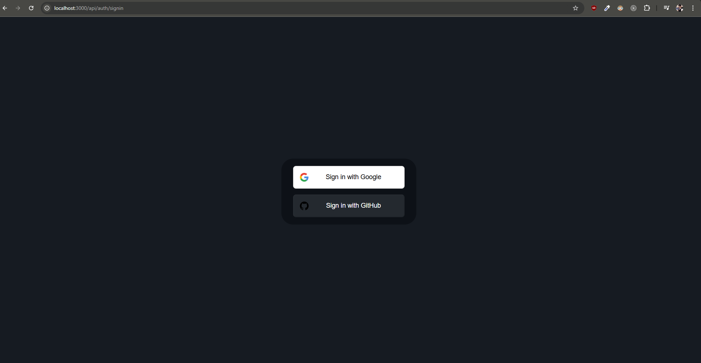

5. Ahora vamos a definir las 2 variables de entorno en el archivo `.env` y nos vamos a la [Documentación para tener las credenciales de Google](https://console.cloud.google.com/welcome/new?pli=1).
   En la documentación nos iremos al apartado de `seleccionar un proyecto` y buscamos la opciones `PROYECTO NUEVO` ubicado en el lateral derecho.
   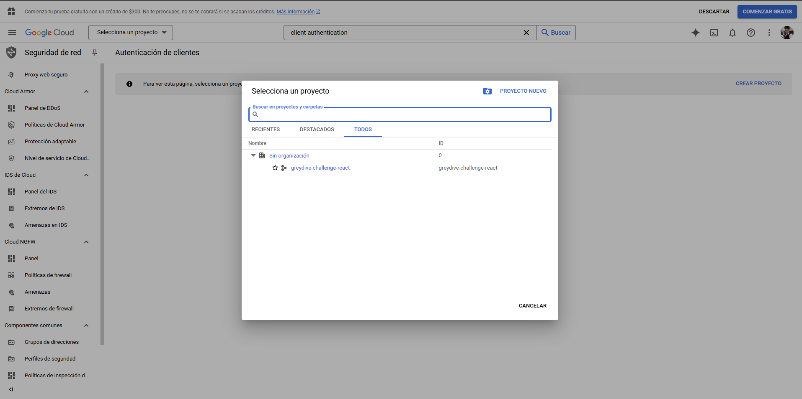

6. Cambiamos el nombre a nuestro y le damos en crear
   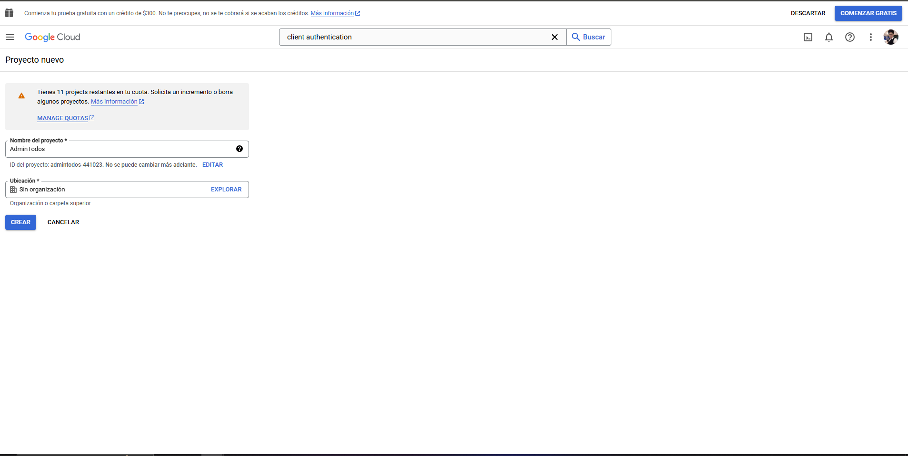

7. Esperamos unos minutos que lo crea al proyecto y en la ventana emergente de la notificación le damos en la opción de `SELECCIONAR PROYECTO`.
   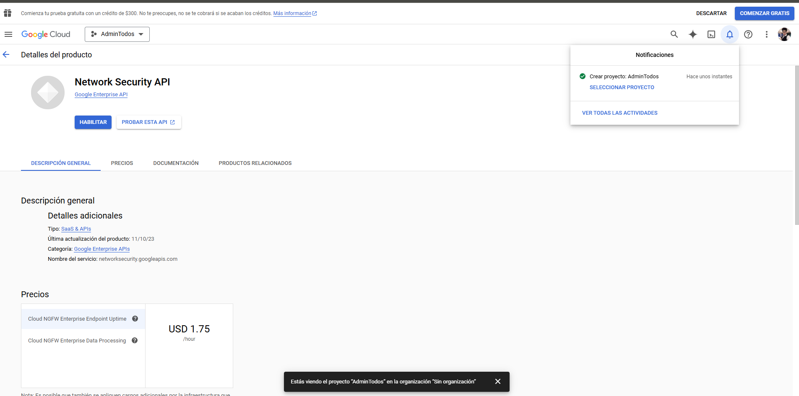

8. Una vez creado el proyecto, en el buscador => `credentials` y vamos a buscar la opcion de `+ CREAR CREDENCIALES` y seleccionamos => `ID de cliente de OAuth`

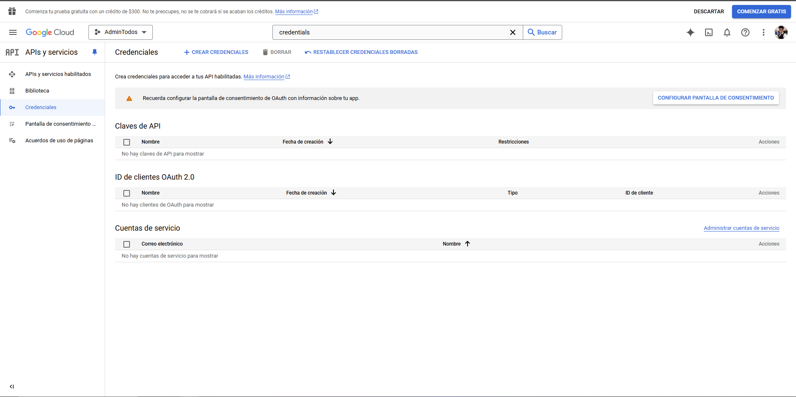
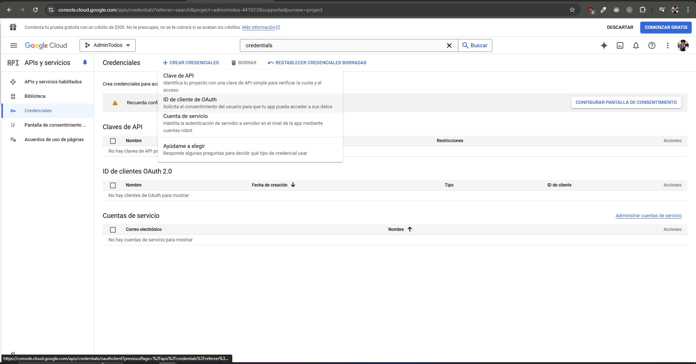

9. Ahora nos toca configurar la `PANTALLA DE CONSENTIMIENTO`
   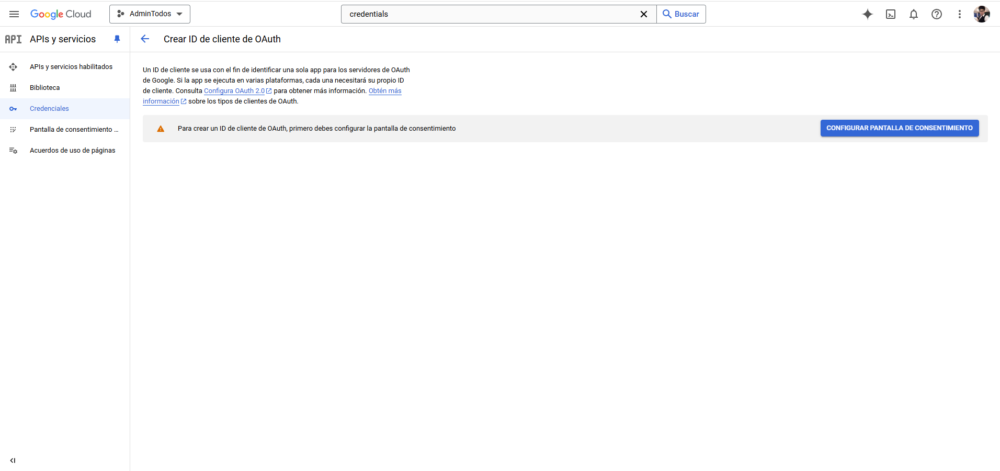

- interno => es para nuestro usuario personal.
- externo => es para cualquier usuario que tenga una cuenta de google.

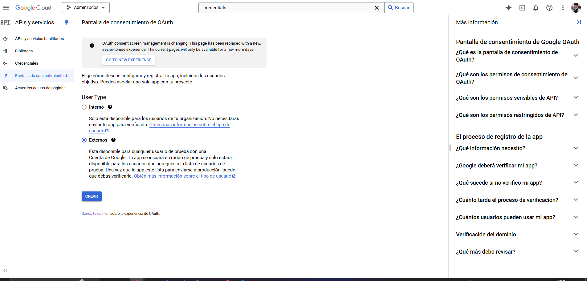

- nombre de la app
- selección del correo electrónico de asistencia del usuario, es decir, nuestro correo.
- logotipo => podemos subir una imagen.
- dominio de la app => podemos dejarlo asi por el momento.
- dominio autorizados => es para habilitar en que dominios se puede utilizar nuestro método de autenticación. Si no se especifica ninguno cualquier dominio lo puede utilizar.
- info del contacto => nuestro mail.

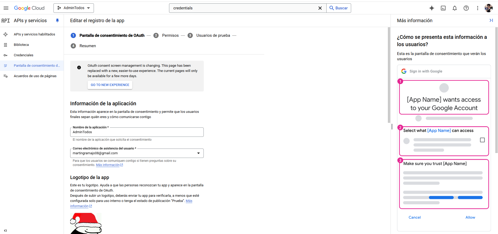

- Permisos => lo dejamos por defecto a todo. Porque lo único que necesitamos es la información general del usuario de google.
  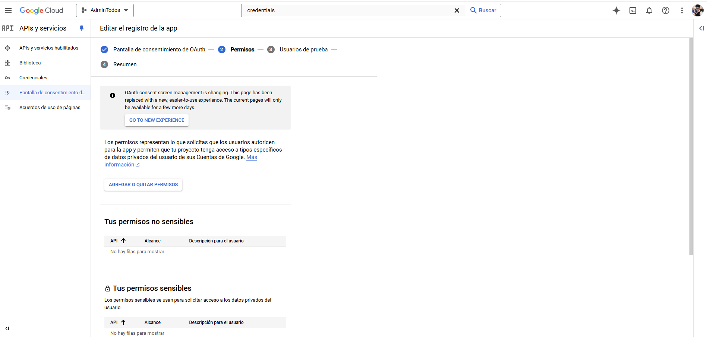

- usuarios de prueba => le damos a la opción de guardar y continuar
  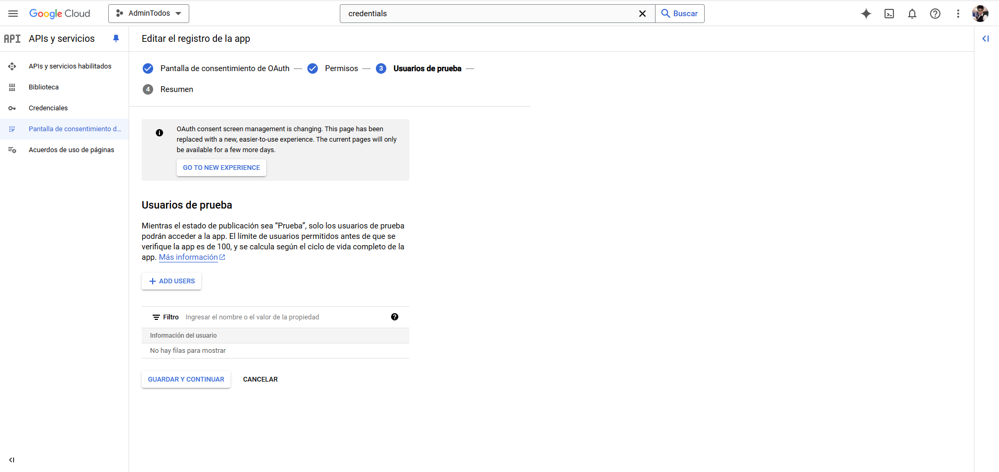

- Por ultimo nos da un resumen de la info y seleccionamos `Volver al panel`
  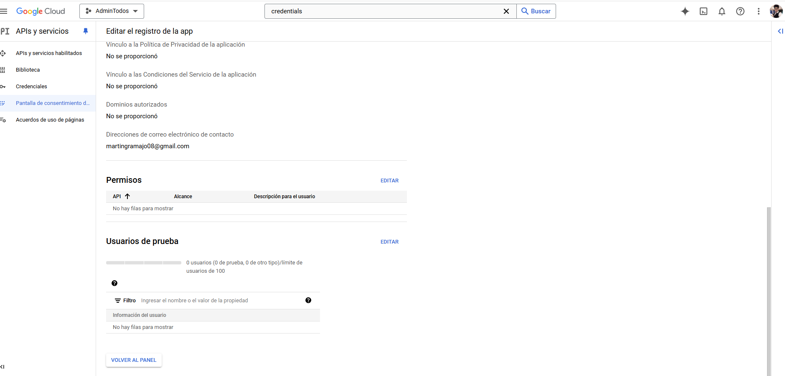

10. Volvemos al apartado de `credenciales` => `+Crear Credenciales` => ` ID de cliente OAuth`
    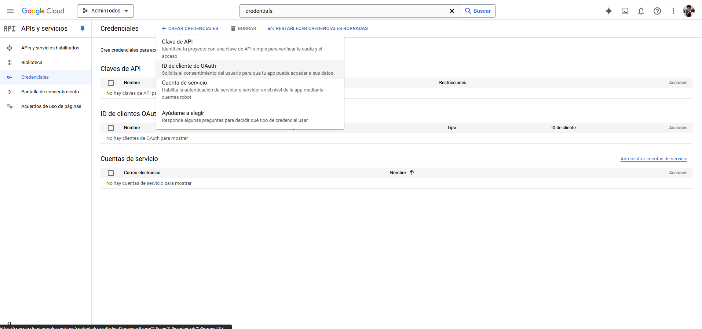

11. Ahora nos aparece una pantalla para configurar nuestra app => en donde tenemos que configurar el tipo de app y el nombre de la key de la app
    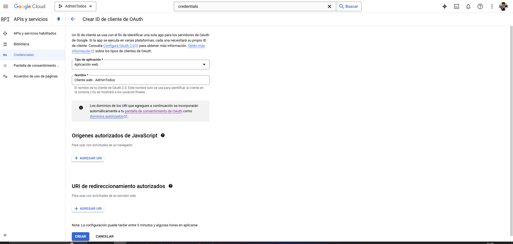

- Orígenes autorizados de JavaScript: esta opción la dejamos por defecto.

- URI de redireccionamiento autorizados => `OBLIGATORIO` por url vamos a utilizar http://localhost:3000/api/auth/callback/:provider

NOTA: A la url la vamos a modificar para nuestras necesidades => http://localhost:3000/api/auth/callback/google

NOTA2: Cuando estemos en `Producción` vamos a cambiar el localhost:3000 por nuestro dominio autorizado

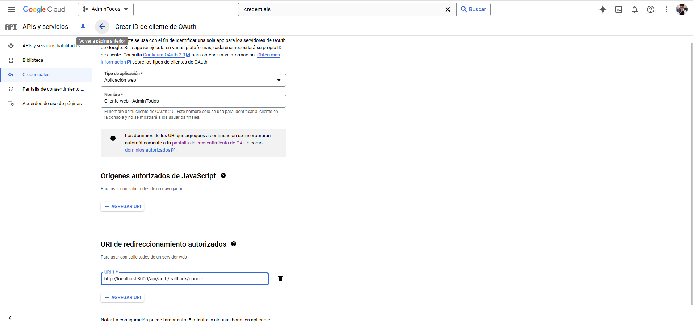

12. Por ultimo nos sale una ventana emergente con el `client id` y el ` client secret` que vamos a utilizar en nuestro `.env` y revisamos en route.ts que estén definida nuestras dos variables de entorno

```js
import NextAuth, { NextAuthOptions } from "next-auth";
import GithubProvider from "next-auth/providers/github";
import GoogleProvider from "next-auth/providers/google";

// creamos esta const para definir nuestros providers
// ademas los creamos de esta forma para poder utilizar la referencia (authOptions) en otros lugares
export const authOptions: NextAuthOptions = {
  // Configure one or more authentication providers
  providers: [
    GoogleProvider({
      clientId: process.env.GOOGLE_CLIENT_ID ?? "",
      clientSecret: process.env.GOOGLE_CLIENT_SECRET ?? "",
    }),
    GithubProvider({
      clientId: process.env.GITHUB_ID ?? "",
      clientSecret: process.env.GITHUB_SECRET ?? "",
    }),
    // ...add more providers here
  ],
};

// con esto lo estamos segmentando
const handler = NextAuth(authOptions);

// Esto es para el manejo de peticiones GET Y POST por handler
// lo cual es necesario ya que NEXT ahora maneja los archivos de peticiones GET Y POST

export { handler as GET, handler as POST };
```

## Logout y SignIn

Trabajamos en el componente `Sidebar` en donde vamos a configurar el botón de logout

```js
<div className="px-6 -mx-6 pt-4 flex justify-between items-center border-t">
  <button className="px-4 py-3 flex items-center space-x-4 rounded-md text-gray-600 group">
    <CiLogout />
    <span className="group-hover:text-gray-700">Logout</span>
  </button>
</div>
```

1. Vamos a crear un component adicional, pero antes en la carpeta `components` vamos a guardar por carpeta los componentes y actualizar el archivo de barril, esto con la intención de dejar un código mas limpio y ordenado. En la nueva carpeta `sidebar` vamos a crear el component adicional para trabajarlo desde el lado del cliente=>

```js
"use client";
import { CiLogout } from "react-icons/ci";

const LogoutButton = () => {
  return (
    <button className="px-4 py-3 flex items-center space-x-4 rounded-md text-gray-600 group">
      <CiLogout />
      <span className="group-hover:text-gray-700">Logout</span>
    </button>
  );
};

export default LogoutButton;
```

2. Tomamos los datos de la session y con esos datos vamos a crear condiciones
   extra: le agregue un spinner de tailwind

```js
"use client";
import { useSession } from "next-auth/react";
import { CiLogout } from "react-icons/ci";

const LogoutButton = () => {
  const { data: session, status } = useSession();

  if (status === "loading") {
    return (
      <div className="flex flex-row space-x-4">
        <div
          className="w-12 h-12 rounded-full animate-spin
                    border-8 border-dashed border-purple-500 border-t-transparent"
        >
          Espere...
        </div>
      </div>
    );
  }

  if (status === "unauthenticated") {
    return (
      <button className="px-4 py-3 flex items-center space-x-4 rounded-md text-gray-600 group">
        <CiLogout />
        <span className="group-hover:text-gray-700">Ingresar</span>
      </button>
    );
  }

  return (
    <button className="px-4 py-3 flex items-center space-x-4 rounded-md text-gray-600 group">
      <CiLogout />
      <span className="group-hover:text-gray-700">Logout</span>
    </button>
  );
};

export default LogoutButton;
```

3. De next-auth/react vamos a importar el `signIn` y `signOut`

```js
import { useSession, signIn, signOut } from "next-auth/react";
```

4. Lo utilizamos en el button con el event onClick tanto en el login como el logout =>

```js
"use client";
import { useSession, signIn, signOut } from "next-auth/react";
import { CiLogout } from "react-icons/ci";

const LogoutButton = () => {
  const { data: session, status } = useSession();

  if (status === "loading") {
    return (
      <div className="flex flex-row space-x-4">
        <div
          className="w-8 h-8 rounded-full animate-spin
                    border-8 border-dashed border-blue-800 border-t-transparent"
        ></div>
      </div>
    );
  }

  if (status === "unauthenticated") {
    return (
      <button
        onClick={() => signIn()}
        className="px-4 py-3 flex items-center space-x-4 rounded-md text-gray-600 group"
      >
        <CiLogout />
        <span className="group-hover:text-gray-700">Login</span>
      </button>
    );
  }

  return (
    <button
      onClick={() => signOut()}
      className="px-4 py-3 flex items-center space-x-4 rounded-md text-gray-600 group"
    >
      <CiLogout />
      <span className="group-hover:text-gray-700">Logout</span>
    </button>
  );
};

export default LogoutButton;
```

## Prisma Adapter - AuthJS

Una de las cosas que necesitamos es poder tener la información del usuario en nuestra base de datos, es decir, que tendríamos que tener una tabla que nos diga cuales son los usuarios que están registrado en nuestra app. Lo cual nos permitiría poder bloquear o asignar roles entre otras cuestiones.

Para acceder a esa info vamos a utilizar la [Documentación Prisma Adapter](https://authjs.dev/getting-started/adapters/prisma)=>

1. Ejecutamos en la terminal los siguientes comandos:

`npm install @prisma/client @auth/prisma-adapter`
`npm install prisma --save-dev`

2. En el archivo donde tenemos el adaptador => auth/[...nextAuth]/route.ts tenemos que agregar una configuración

```js
  // configuración del adaptador =>
  // adapter: PrismaAdapter que lo traemos de next-auth.
  // Prisma Adapter: tenemos que enviarle el object de prisma.

  adapter: PrismaAdapter( prisma),
```

3. Ahora tenemos que crear nuestro `schema` => para ello utilizamos el schema recomendado por la documentación, el cual lo vamos a agregar en el archivo `schema.prisma`.

```js
model Account {
  id                 String  @id @default(cuid())
  userId             String  @map("user_id")
  type               String
  provider           String
  providerAccountId  String  @map("provider_account_id")
  refresh_token      String? @db.Text
  access_token       String? @db.Text
  expires_at         Int?
  token_type         String?
  scope              String?
  id_token           String? @db.Text
  session_state      String?

  user User @relation(fields: [userId], references: [id], onDelete: Cascade)

  @@unique([provider, providerAccountId])
  @@map("accounts")
}

model Session {
  id           String   @id @default(cuid())
  sessionToken String   @unique @map("session_token")
  userId       String   @map("user_id")
  expires      DateTime
  user         User     @relation(fields: [userId], references: [id], onDelete: Cascade)

  @@map("sessions")
}

model User {
  id            String    @id @default(cuid())
  name          String?
  email         String?   @unique
  emailVerified DateTime? @map("email_verified")
  image         String?
  accounts      Account[]
  sessions      Session[]

  @@map("users")
}

model VerificationToken {
  identifier String
  token      String
  expires    DateTime

  @@unique([identifier, token])
  @@map("verification_tokens")
}

```

NOTA: falta un elemento en el model el cual lo agregamos a continuación

4. Como hicimos cambios en nuestra base tenemos que hacer la migración correspondiente con el siguiente comando => `npx prisma migrate dev`. Como siempre para asegurarnos que este todo correcto ejecutamos la creación del cliente => `npx prisma generate`

5. El elemento que tenemos que agregar en el model es el siguiente => como hicimos cambios en el model tenemos que que volver a migrar y generar con los comandos del apartado 4.

```js

model Account {
  refresh_token_expires_in Int?
}

```

6. En caso de tirar error al intentar hacer login con la cuenta de github, tenemos que cambiar el model por el siguiente y como hacemos modificaciones en nuestra base tenemos que migrar y generar.

```js
// Auth.js

model Account {
  id                String  @id @default(cuid())
  userId            String
  type              String
  provider          String
  providerAccountId String
  refresh_token     String? @db.Text
  access_token      String? @db.Text
  expires_at        Int?
  token_type        String?
  scope             String?
  id_token          String? @db.Text
  session_state     String?

  user User @relation(fields: [userId], references: [id], onDelete: Cascade)

  @@unique([provider, providerAccountId])
}

model Session {
  id           String   @id @default(cuid())
  sessionToken String   @unique
  userId       String
  expires      DateTime
  user         User     @relation(fields: [userId], references: [id], onDelete: Cascade)
}

model User {
  id            String    @id @default(cuid())
  name          String?
  email         String?   @unique
  emailVerified DateTime?
  image         String?
  accounts      Account[]
  sessions      Session[]
}

model VerificationToken {
  identifier String
  token      String   @unique
  expires    DateTime

  @@unique([identifier, token])
}

```

7. Al hacer login con cualquiera de los proveedores, podemos ver en las tablas de tablePlus que tenemos los datos del users =>
   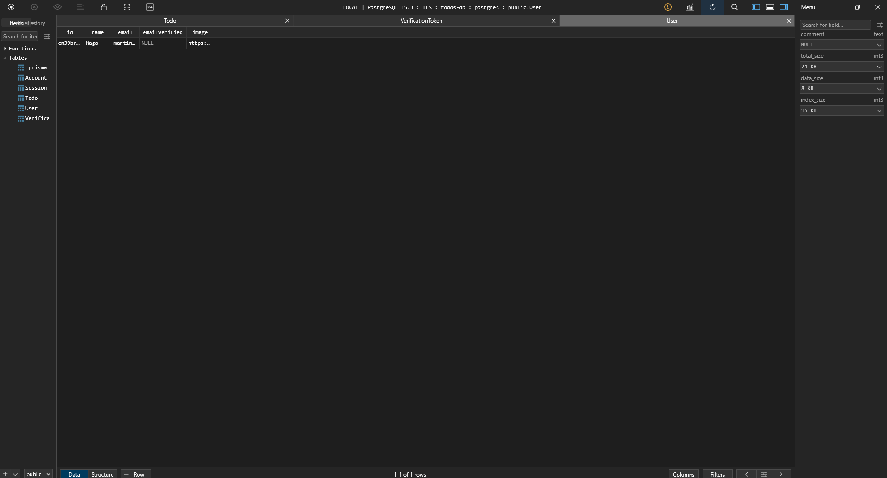

## UUID en lugar CUID (generado por defecto en la tabla)

Este cambio es para mantener el orden de trabajo, ya que en el model Todo estamos trabajando con `uuid()` lo vamos a ocupar en el model de `Account`

1. Para efectuar el cambio tenemos que tomar el uuid() del model `TODO` y colocarlo en el id del model `Account y en todos donde este el cuid()`

2. En `tablePlus` borramos el elemento creado con el cuid().

3. Como hicimos cambios en nuestra base tenemos que hacer una migración y generarla nuevamente.

4. Para probar => hacemos login y si todo esta correctamente tendríamos que ver el id generado con uuid() en nuestro tablePlus
   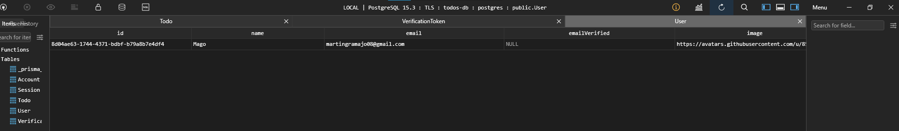

## Campos adicionales al usuario

Ademas de la datos de name,email,image del user necesito otros datos como el rol, si esta activo o no, como cualquier otra información que necesitemos.

1. Continuamos trabajando sobre el archivo `schema.prisma` en donde vamos a modificar el model `User` ya que nada nos impide agregar campos adicionales pero depende mucho de la relaciones entre tablas.

```js
model User {
  id       String   @id @default(uuid())
  name     String?
  // campos adicionales
  roles    String[] @default(["user"])
  isActive Boolean  @default(true)

  email         String?   @unique
  emailVerified DateTime?
  image         String?

  // estas son las tablas relacionadas con user
  accounts Account[]
  sessions Session[]
}

```

2. Como hicimos cambios, aunque sea repetitivo, siempre tenemos que tirar los comandos de migración y de generación.

3. Para verificar nos iremos a tablePlus y veremos las dos nuevas columnas
   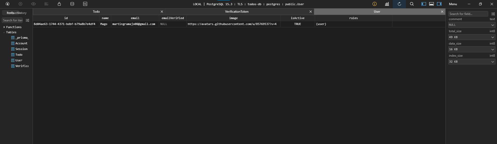

4. Una vez verificado, tenemos que decirle que esas dos nuevas columnas van a ser parte del User. Para ello nos iremos SRC/APP/AUTH/[...NEXTAUTH]/route.ts, para emplear modificaciones en este ultimo archivo.

5. En el archivo router agregaremos las siguientes modificaciones

```js
export const authOptions: NextAuthOptions = {
  // configuración del adaptador =>
  // adapter: PrismaAdapter que lo traemos de next-auth.
  // Prisma Adapter: tenemos que enviarle el object de prisma.

  adapter: PrismaAdapter(prisma),

  // Configure one or more authentication providers
  providers: [
    GoogleProvider({
      clientId: process.env.GOOGLE_CLIENT_ID ?? "",
      clientSecret: process.env.GOOGLE_CLIENT_SECRET ?? "",
    }),
    GithubProvider({
      clientId: process.env.GITHUB_ID ?? "",
      clientSecret: process.env.GITHUB_SECRET ?? "",
    }),
    // ...add more providers here
  ],

  // modificaciones para manejar la data del user
  session: {
    strategy: "jwt",
  },

  callbacks: {
    async signIn({ user, account, credentials, email, profile }) {
      console.log(user);
      return false; // si retornamos un false estamos negando la autenticación
    },
  },
};
```

6. Al colocar en false el retorno de de los callbacks, estamos negando la autenticación y si vemos por consola el log nos retorna el user => esto lo podemos utilizar para bloquear usuarios en determinados dominios.
   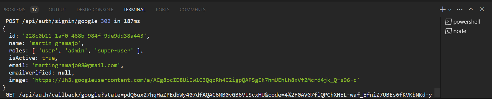

7. Realizada la prueba cambiamos el false por `true` y agregamos dos nuevas config `jwt` y `session`

```js
export const authOptions: NextAuthOptions = {
  // configuración del adaptador =>
  // adapter: PrismaAdapter que lo traemos de next-auth.
  // Prisma Adapter: tenemos que enviarle el object de prisma.

  adapter: PrismaAdapter(prisma),

  // Configure one or more authentication providers
  providers: [
    GoogleProvider({
      clientId: process.env.GOOGLE_CLIENT_ID ?? "",
      clientSecret: process.env.GOOGLE_CLIENT_SECRET ?? "",
    }),
    GithubProvider({
      clientId: process.env.GITHUB_ID ?? "",
      clientSecret: process.env.GITHUB_SECRET ?? "",
    }),
    // ...add more providers here
  ],

  // modificaciones para manejar la data del user

  // agregamos el session
  session: {
    strategy: "jwt",
  },

  // los callbacks
  callbacks: {
    async signIn({ user, account, credentials, email, profile }) {
      console.log(user);

      return true; // si retornamos un false estamos negando la autenticación
    },

    // jwt
    // la idea es tener la info que yo quiero que se pase a la session
    // IMPORTANTE : se debe respetar el orden primero el jwt() esto es para enviar información y después la session que va a recibir la información
    async jwt({ token, user, account, profile }) {
      return token;
    },

    // cuando hacemos la session
    // lo importante de la session es enviar la session pero modificada con la información recibida por el jwt.
    async session({ session, token, user }) {
      return session;
    },
  },
};
```

8. La idea de los campos anteriores es que cuando nos estamos autenticando con JWT es revisar que info tenemos en el token, para ello le hacemos un log al token y nos retorna lo siguiente al recargar el navegador =>
   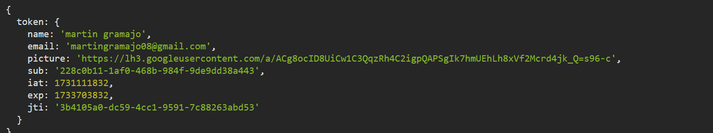

9. De esos datos el que nos interesa es el email para verificar en nuestra base de datos en la parte del token =>
   Con ello vamos a visualizar lo siguiente por consola:
   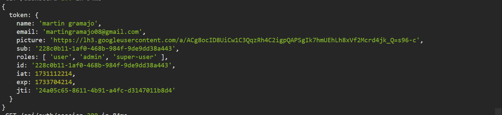

```js
   async jwt({token, user, account, profile}){
      console.log({token});

      // esto es para encontrar el usuario en la base de datos y que la información que vamos a enviar en la session sea la misma que tenemos en la base de datos
      const dbUser = await prisma.user.findUnique({where:{email: token.email ?? 'no-email'}})

      token.roles = dbUser?.roles ?? ['no-roles'];
      token.id = dbUser?.id ?? ['no-uuid'];

      return token;
     },

```

10. Ahora vamos a trabajar sobre la session para modificarla y recibir toda la info que le envía el jwt

```js
  async session({session, token, user}){

      // ahora vamos a modificar la session para tener los datos que le pasa jwt
      // la idea es reemplazar los datos que ya tiene la session por los que se le envía por token.
      if(session && session.user){
        session.user.roles = token.roles;
        session.user.id = token.id;
      }

      return session;
     }
```
